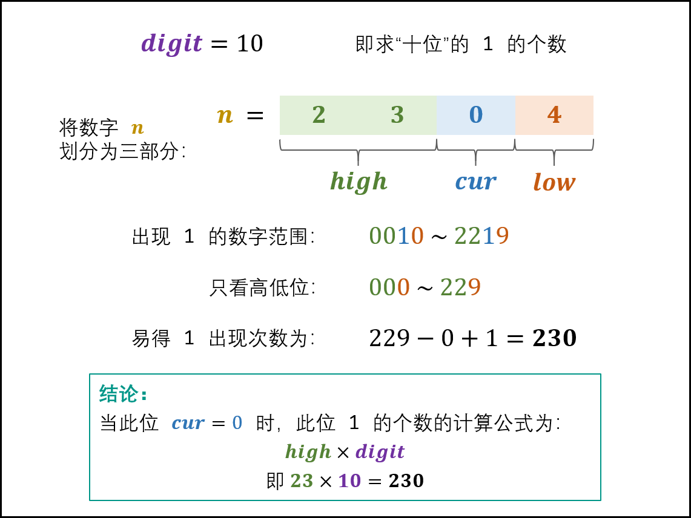
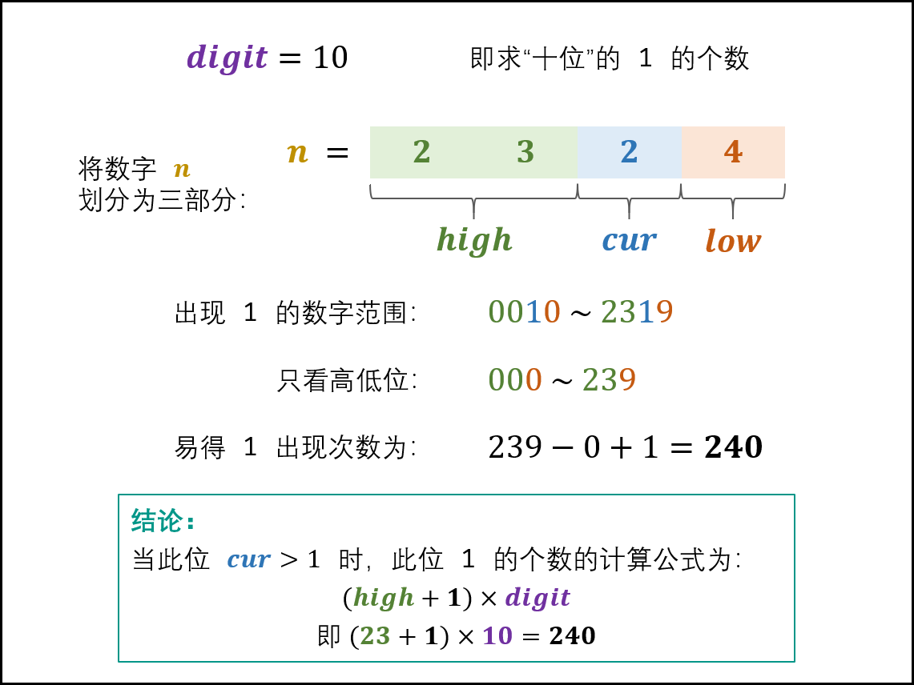

#### 8-7 [457. Circular Array Loop](https://leetcode-cn.com/problems/circular-array-loop/)

> You are playing a game involving a circular array of non-zero integers nums. Each nums[i] denotes the number of indices forward/backward you must move if you are located at index i:
>
> If nums[i] is positive, move nums[i] steps forward, and
> If nums[i] is negative, move nums[i] steps backward.
> Since the array is circular, you may assume that moving forward from the last element puts you on the first element, and moving backwards from the first element puts you on the last element.
>
> A cycle in the array consists of a sequence of indices seq of length k where:
>
> Following the movement rules above results in the repeating index sequence seq[0] -> seq[1] -> ... -> seq[k - 1] -> seq[0] -> ...
> Every nums[seq[j]] is either all positive or all negative.
> k > 1
> Return true if there is a cycle in nums, or false otherwise.

```
class Solution {
public:
    bool circularArrayLoop(vector<int>& nums) {
        if(nums.size()<2) return false;
        int slow,fast,n=nums.size();
        auto next=[&](int x)->int{
            return ((x+nums[x])%n+n)%n;
        };
        for(int i=0;i<n;i++){
            slow=i;
            fast=next(slow);
            cout<<slow<<"???"<<fast<<endl;
            while(nums[slow]*nums[fast]>0&&nums[slow]*nums[next(slow)]>0){
                cout<<slow<<"II"<<fast<<endl;
                if(slow==fast){
                    cout<<slow<<endl;
                    if(slow!=next(slow)){
                        return true;
                    }
                    break;
                }
                slow=next(slow);
                fast=next(next(fast));
            }
            int temp=i;
            while(nums[temp]*nums[next(temp)]>0){
                int net=next(temp);
                nums[temp]=0;
                temp=net;
            }
        }
        return false;
    }
};
```

```

```

#### 8-8 [1137. N-th Tribonacci Number](https://leetcode-cn.com/problems/n-th-tribonacci-number/)

> The Tribonacci sequence Tn is defined as follows: 
>
> T0 = 0, T1 = 1, T2 = 1, and Tn+3 = Tn + Tn+1 + Tn+2 for n >= 0.
>
> Given n, return the value of Tn.

```c++
class Solution {
public:
    int tribonacci(int n) {
        if(n==0) return n;
        if(n==1||n==2) return 1;
        return tribonacci(n-1)+tribonacci(n-2)+tribonacci(n-3);
    }
};
```

```c++
class Solution {
public:
    int tribonacci(int n) {
        if(n<2) return n;
        vector<int> dp(n+1);
        dp[0]=0;
        dp[1]=dp[2]=1;
        for(int i=3;i<=n;i++){
            dp[i]=dp[i-1]+dp[i-2]+dp[i-3];
        }
        return dp[n];
    }
};
```

```c++
class Solution {
public:
    int tribonacci(int n) {
        if(n<2) return n;
        int p,q,r;
        p=0;
        q=r=1;
        for(int i=3;i<=n;i++){
            int temp=p+q+r;
            p=q;
            q=r;
            r=temp;
        }
        return r;
    }
};
```

#### 8-9 [313. Super Ugly Number](https://leetcode-cn.com/problems/super-ugly-number/)

> A super ugly number is a positive integer whose prime factors are in the array primes.
>
> Given an integer n and an array of integers primes, return the nth super ugly number.
>
> The nth super ugly number is guaranteed to fit in a 32-bit signed integer.

```c++
class Solution {
public:
    int nthSuperUglyNumber(int n, vector<int>& primes) {
        set<long> duplicate;
        priority_queue<long,vector<long>,greater<long>> q;
        int i,j;
        q.push(1);
        duplicate.insert(1);
        for(i=0;i<n-1;i++){
            long k=q.top();
            q.pop();
            for(j=0;j<primes.size();j++){
                if(!duplicate.count(primes[j]*k)){
                    q.push(primes[j]*k);
                    duplicate.insert(primes[j]*k);
                }    
            }
        }
        return q.top();
    }
};
```

#### 8-10 [413. Arithmetic Slices](https://leetcode-cn.com/problems/arithmetic-slices/)

> An integer array is called arithmetic if it consists of at least three elements and if the difference between any two consecutive elements is the same.
>
> For example, [1,3,5,7,9], [7,7,7,7], and [3,-1,-5,-9] are arithmetic sequences.
> Given an integer array nums, return the number of arithmetic subarrays of nums.
>
> A subarray is a contiguous subsequence of the array.
>

```c++
class Solution {
public:
    unordered_map<int,int> record;
    int calculate(int n){
        if(n<3) return 0;
        if(record[n]) return record[n];
        int sum=0;
        // Cn3+Cn4+...+Cnn
        for(int i=3;i<=n;i++){
            sum+=n-i+1;
        }
        record[n]=sum;
        return sum;
    }
    int numberOfArithmeticSlices(vector<int>& nums) {
        if(nums.size()<3) return 0;
        int i,j,res=0;
        i=0,j=1;
        while(j<nums.size()){
            int minus=nums[j]-nums[j-1];
            j++;
            while(j<nums.size()&&minus==nums[j]-nums[j-1]){
                j++;
            }
            if(j-i>2){
                res+=calculate(j-i);
                i=j-1;
            }else{
                i++;
                j=i+1;
            }
        }
        return res;
    }
};
```

#### 8-12 [516. Longest Palindromic Subsequence](https://leetcode-cn.com/problems/longest-palindromic-subsequence/)

> Given a string s, find the longest palindromic subsequence's length in s.
>
> A subsequence is a sequence that can be derived from another sequence by deleting some or no elements without changing the order of the remaining elements.
>
> ```
> s = "bbbab"
> output:4 "bbbb"
> ```

这个问题对 dp 数组的定义是：在子串`s[i..j]`中，最长回文子序列的长度为`dp[i][j]`

从已知推向未知：要求`dp[i][j]`的值，我们可以借助`dp[i+1][j-1]`的值，可以简单得知，如果`s[i]==s[j]`，那么`dp[i][j]=dp[i+1][j-1]+2`；如果`s[i]!=s[j]`说明它俩不可能同时出现在`s[i..j]`的最长回文子序列中，那么把它俩分别加入`s[i+1..j-1]`中，看看哪个子串产生的回文子序列更长即可，那么`dp[i][j]=max(dp[i+1][j],dp[i][j-1])`

我们考虑一下base case的值，如果只有一个字符，那么最长子序列的值为1，因为`i<=j`必然成立，所以对于`i>j`的情况，值应该初始化为0。


```c++
class Solution {
public:
    int longestPalindromeSubseq(string s) {
        int n=s.size();
        vector<vector<int>> dp(n,vector<int>(n,0));
        for(int i=0;i<n;i++){
            dp[i][i]=1;
        }
        for(int i=n-1;i>=0;i--){
            for(int j=i+1;j<n;j++){
                if(s[i]==s[j]){
                    dp[i][j]=dp[i+1][j-1]+2;
                }else{
                    dp[i][j]=std::max(dp[i][j-1],dp[i+1][j]);
                }
            }
        }
        return dp[0][n-1];
    }
};
```

8-13 [233. Number of Digit One](https://leetcode-cn.com/problems/number-of-digit-one/)

> Given an integer n, count the total number of digit 1 appearing in all non-negative integers less than or equal to n.

设数字n是个x位数，记n的第i位为ni，则n=nxnx-1……n2n1

ni为当前位置，记为cur

ni-1…n2n1为低位，记为low

nxnx-1…ni+1称为高位，记为high

将10^i称为位因子，记为digit

根据cur的值，分为以下三种情况：

cur=0，1的出现次数由high决定，high*digit



cur=1,1的出现次数由高低位共同决定,high*digit+low+1


cur=2,3……9，1的出现次数只由高位决定，(high+1)*digit



```c++
class Solution {
public:
    int countDigitOne(int n) {
        long digit=1;
        int res = 0;
        int high=n/10;
        int cur=n%10;
        int low = 0;
        while(!(high==0&&cur==0)){
            if(cur==0){
                res+=high*digit;
            }else if(cur==1){
                res+=high*digit+low+1;
            }else{
                res+=(high+1)*digit;
            }
            low+=cur * digit;
            cur=high % 10;
            high/=10;
            digit*=10;
        }
        return res;
    }
};

```

8-14 [1583. Count Unhappy Friends](https://leetcode-cn.com/problems/count-unhappy-friends/)

> You are given a list of preferences for n friends, where n is always even.
>
> For each person i, preferences[i] contains a list of friends sorted in the order of preference. In other words, a friend earlier in the list is more preferred than a friend later in the list. Friends in each list are denoted by integers from 0 to n-1.
>
> All the friends are divided into pairs. The pairings are given in a list pairs, where pairs[i] = [xi, yi] denotes xi is paired with yi and yi is paired with xi.
>
> However, this pairing may cause some of the friends to be unhappy. A friend x is unhappy if x is paired with y and there exists a friend u who is paired with v but:
>
> x prefers u over y, and
> u prefers x over v.
> Return the number of unhappy friends.

用哈希表来记录对于每一个小朋友比起当前的伙伴更喜欢的小朋友，随后去查看每一个小朋友，遍历他的更喜欢的列表，如果对应小朋友的列表也有他，那么他俩就都是不开心的。

`0:[]`

`1:[3,2]`

`2:[]`

`3:[1]`

```c++
class Solution {
public:
    vector<int> findMorePre(vector<int> preList,int fri){
        int i;
        for(i=0;i<preList.size();i++){
            if(preList[i]==fri) break;
        }
        return {preList.begin(),preList.begin()+i};
    }
    bool findFriend(vector<int> preList,int fri){
        for(int i=0;i<preList.size();i++){
            if(preList[i]==fri) return true;
        }
        return false;
    }
    int unhappyFriends(int n, vector<vector<int>>& preferences, vector<vector<int>>& pairs) {
        int i,j;
        set<int> unhappy;
        unordered_map<int,vector<int>> recordPair;
        for(i=0;i<pairs.size();i++){
            recordPair[pairs[i][0]]=findMorePre(preferences[pairs[i][0]],pairs[i][1]);
            recordPair[pairs[i][1]]=findMorePre(preferences[pairs[i][1]],pairs[i][0]);
        }
        for(i=0;i<n;i++){
            if(unhappy.count(i)) continue;
            vector<int> morePre=recordPair[i];
            if(!morePre.size()) continue;
            for(int each:morePre){
                if(findFriend(recordPair[each],i)){
                    unhappy.insert(i);
                    unhappy.insert(each);
                }
            }

        }
        return unhappy.size();    
    }
};
```

创建 n 行 n 列的二维数组list，其中`list[i][j]`表示朋友j在i的朋友列表中的亲近程度下标。遍历preferences 即可填入list中的全部元素的值。

所有的朋友被分成n/2对，为了快速知道每位朋友的配对的朋友，对于配对情况也需要进行预处理。创建长度为n的数组match，如果x和y配对，则有`macth[x]=y`以及`match[y]=x`。

进行预处理之后，即可统计不开心的朋友的数目。

遍历从0到n-1的每位朋友x，进行如下操作。

1. 找到与朋友x配对的朋友y。
2. 找到朋友 y 在朋友 x 的朋友列表中的亲近程度下标，记为index。
3. 朋友 x 的朋友列表中的下标从 0 到 index−1 的朋友都是可能的 u。遍历每个可能的 u，找到与朋友 u 配对的朋友 v。
4. `list[u][x]<list[u][v]`，则 x 是不开心的朋友。

```c++
class Solution {
public:
    int unhappyFriends(int n, vector<vector<int>>& preferences, vector<vector<int>>& pairs) {
        vector<vector<int>> list(n,vector<int>(n));
        int i,j;
        int unhappy=0;
        for(i=0;i<n;i++){
            for(j=0;j<n-1;j++){
                list[i][preferences[i][j]]=j;
            }
        }
        vector<int> match(n);
        for(i=0;i<pairs.size();i++){
            match[pairs[i][0]]=pairs[i][1];
            match[pairs[i][1]]=pairs[i][0];  
        }
        for(i=0;i<n;i++){
            int index=list[i][match[i]];
            for(j=0;j<index;j++){
                int u=preferences[i][j];
                int v=match[u];
                if(list[u][i]<list[u][v]){
                    unhappy++;
                    break;
                }
            }
        }
        return unhappy;
    }
};
```

#### 8-18 [552. Student Attendance Record II](https://leetcode-cn.com/problems/student-attendance-record-ii/)

> An attendance record for a student can be represented as a string where each character signifies whether the student was absent, late, or present on that day. The record only contains the following three characters:
>
> 'A': Absent.
> 'L': Late.
> 'P': Present.
> Any student is eligible for an attendance award if they meet both of the following criteria:
>
> The student was absent ('A') for strictly fewer than 2 days total.
> The student was never late ('L') for 3 or more consecutive days.
> Given an integer n, return the number of possible attendance records of length n that make a student eligible for an attendance award. The answer may be very large, so return it modulo 109 + 7.

```c++
class Solution {
public:
    int checkRecord(int n) {
        const int MOD=1000000007;
        // dp[i][j][k]代表前i位有j个A和末尾k个连续的L
        vector<vector<vector<int>>> dp(n+1,vector<vector<int>>(2,vector<int>(3)));
        dp[0][0][0]=1;
        int i,j,k;
        for(i=1;i<=n;i++){
            // 如果i的值为p
            for(j=0;j<2;j++){
                for(k=0;k<3;k++){
                    dp[i][j][0]=(dp[i][j][0]+dp[i-1][j][k])%MOD;
                }
            }
            //如果i的值为A
            for(k=0;k<3;k++){
                dp[i][1][0]=(dp[i][1][0]+dp[i-1][0][k])%MOD;
            }
            //如果i的值为L
            for(j=0;j<2;j++){
                for(k=0;k<2;k++){
                    dp[i][j][k+1]=(dp[i][j][k+1]+dp[i-1][j][k])%MOD;
                }
            }    
        }
        int res=0;
        for(j=0;j<2;j++){
            for(k=0;k<3;k++){
                res=(res+dp[n][j][k])%MOD;
            }
        } 
        return res;
    }
};
```

```python
class Solution:
    def checkRecord(self, n: int) -> int:
        MOD=1000000007
        dp=[[[0,0,0],[0,0,0]] for _ in range(0,n+1)]
        dp[0][0][0]=1
        for i in range(1,n+1):
            # P
            for j in range(0,2):
                for k in range(0,3):
                    dp[i][j][0]=(dp[i][j][0]+dp[i-1][j][k])%MOD
            # A
            for k in range(0,3):
                dp[i][1][0]=(dp[i][1][0]+dp[i-1][0][k])%MOD
            # L
            for j in range(0,2):
                for k in range(0,2):
                    dp[i][j][k+1]=(dp[i][j][k+1]+dp[i-1][j][k])%MOD
        res=0
        for j in range(0,2):
                for k in range(0,3):
                    res+= dp[n][j][k]%MOD
        return res%MOD
```


#### 8-19 [345. Reverse Vowels of a String](https://leetcode-cn.com/problems/reverse-vowels-of-a-string/)

> Given a string s, reverse only all the vowels in the string and return it.
>
> The vowels are 'a', 'e', 'i', 'o', and 'u', and they can appear in both cases.

```c++
class Solution {
public:
    string reverseVowels(string s) {
        int l=0,r=s.size()-1;
        auto vowels=[](char c){
            c=tolower(c);
            if(c=='a'||c=='e'||c=='i'||c=='o'||c=='u') return true;
            return false;
        };
        while(l<=r){
            if(!vowels(s[l])){
                l++;
            }else{
                if(!vowels(s[r])){
                    r--;
                }else{
                    // l,r互换
                    char temp=s[l];
                    s[l]=s[r];
                    s[r]=temp;
                    l++;
                    r--;
                }
            }
        }
        return s;
    }
};
```

```python
class Solution:
    def reverseVowels(self, s: str) -> str:
        base='aeiouAEIOU'
        l,r=0,len(s)-1
        s=list(s)
        while l<r:
            if s[l] not in base:
                l+=1
            else:
                if s[r] not in base:
                    r-=1
                else:
                    s[l],s[r]=s[r],s[l]
                    l+=1
                    r-=1
        return ''.join(s)
```

#### 8-20 [541. Reverse String II](https://leetcode-cn.com/problems/reverse-string-ii/)

> Given a string s and an integer k, reverse the first k characters for every 2k characters counting from the start of the string.
>
> If there are fewer than k characters left, reverse all of them. If there are less than 2k but greater than or equal to k characters, then reverse the first k characters and left the other as original.

```c++
class Solution {
public:
    string reverseStr(string s, int k) {
        for(int i=0;i<s.size();i+=k*2){
            int l=i,r=i+k>s.size()?s.size()-1:i+k-1;
            while(l<=r){
                char t=s[l];
                s[l]=s[r];
                s[r]=t;
                l++;
                r--;
            }
        }
        return s;
    }
};
```

```python
class Solution:
    def reverseStr(self, s: str, k: int) -> str:
        s=list(s)
        for i in range(0,len(s),2*k):
            l,r=i,i+k-1
            if r>len(s)-1:
                r=len(s)-1
            while l<=r:
                s[l],s[r]=s[r],s[l]
                l+=1
                r-=1
        return ''.join(s)
```

#### 8-21 [443. String Compression](https://leetcode-cn.com/problems/string-compression/)

> Given an array of characters chars, compress it using the following algorithm:
>
> Begin with an empty string s. For each group of consecutive repeating characters in chars:
>
> If the group's length is 1, append the character to s.
> Otherwise, append the character followed by the group's length.
> The compressed string s should not be returned separately, but instead be stored in the input character array chars. Note that group lengths that are 10 or longer will be split into multiple characters in chars.
>
> After you are done modifying the input array, return the new length of the array.
>
> You must write an algorithm that uses only constant extra space.

```c++
class Solution {
public:
    int compress(vector<char>& chars) {
        if(chars.size()==1) return 1;
        int index=0,length,change=0;
        char record;
        while(index<chars.size()){
            record=chars[index];
            length=index;
            while(index<chars.size()&&chars[index]==record){
                index++;
            }
            length=index-length;
            chars[change++]=record;
            if(length>1){
                if(length>=10){
                    stack<int> st;
                    while(length!=0){
                        st.push(length%10);
                        length/=10;
                    }
                    while(!st.empty()){
                        chars[change++]=st.top()+'0';
                        st.pop();
                    }
                }else{
                  chars[change++]=length+'0';  
                }
                
            }
        }
        return change;
    }
};
```

```python
class Solution:
    def compress(self, chars: List[str]) -> int:
        def reverse(left:int, right:int):
            if left==right:
                return
            while left<=right:
                chars[left],chars[right]=chars[right],chars[left]
                left+=1
                right-=1
        left=write=0
        for read in range(0,len(chars)):
            if read==len(chars)-1 or chars[read]!=chars[read+1]:
                chars[write]=chars[left]
                write+=1
                num=read-left+1
                if num>1:
                    start=write
                    while num>0:
                        chars[write]=str(num%10)
                        write+=1
                        num//=10
                    reverse(start,write-1)
                left=read+1
        return write

```

#### 8-22 [789. Escape The Ghosts](https://leetcode-cn.com/problems/escape-the-ghosts/)

> You are playing a simplified PAC-MAN game on an infinite 2-D grid. You start at the point [0, 0], and you are given a destination point target = [xtarget, ytarget], which you are trying to get to. There are several ghosts on the map with their starting positions given as an array ghosts, where ghosts[i] = [xi, yi] represents the starting position of the ith ghost. All inputs are integral coordinates.
>
> Each turn, you and all the ghosts may independently choose to either move 1 unit in any of the four cardinal directions: north, east, south, or west or stay still. All actions happen simultaneously.
>
> You escape if and only if you can reach the target before any ghost reaches you. If you reach any square (including the target) at the same time as a ghost, it does not count as an escape.
>
> Return true if it is possible to escape, otherwise return false.

为了逃脱阻碍者，玩家应按照最短路径向目的地移动。阻碍者为了抓住玩家，也会按照最短路径向目的地移动。由于每次移动为向四个方向之一移动一个单位，因此对于玩家和阻碍者而言，到达目的地的最短路径的距离为当前所在位置和目的地的曼哈顿距离。

用 dist(A, B) 表示 A 点和 B 点的曼哈顿距离，曼哈顿距离的计算方法如下：

Dis(A,B) = |Xa-Xb|+|Ya-Yb|


如果有一个阻碍者和目的地的曼哈顿距离小于玩家和目的地的曼哈顿距离，则该阻碍者可以在玩家之前到达目的地，然后停在目的地，玩家无法逃脱。

如果有一个阻碍者和目的地的曼哈顿距离等于玩家和目的地的曼哈顿距离，则该阻碍者可以和玩家同时到达目的地，玩家也无法逃脱。

如果所有的阻碍者和目的地的曼哈顿距离都大于玩家和目的地的曼哈顿距离，则玩家可以在阻碍者之前到达目的地。

```c++
class Solution {
public:
    bool escapeGhosts(vector<vector<int>>& ghosts, vector<int>& target) {
        int distance = abs(target[0])+abs(target[1]);
        for(vector<int> each:ghosts){
            int ghostDis=abs(each[0]-target[0])+abs(each[1]-target[1]);
            if(ghostDis<=distance) return false;
        }
        return true;
    }
};
```

```python
class Solution:
    def escapeGhosts(self, ghosts: List[List[int]], target: List[int]) -> bool:
        distance=abs(target[0])+abs(target[1])
        for each in ghosts:
            ghostDis=abs(each[0]-target[0])+abs(each[1]-target[1])
            if ghostDis<=distance:
                return False
        return True
```

#### 8-23 [1646. Get Maximum in Generated Array](https://leetcode-cn.com/problems/get-maximum-in-generated-array/)

> You are given an integer n. An array nums of length n + 1 is generated in the following way:
>
> nums[0] = 0
> nums[1] = 1
> nums[2 * i] = nums[i] when 2 <= 2 * i <= n
> nums[2 * i + 1] = nums[i] + nums[i + 1] when 2 <= 2 * i + 1 <= n
> Return the maximum integer in the array nums.

```c++
class Solution {
public:
    int getMaximumGenerated(int n) {
        if(n==0||n==1) return n;
        vector<int> num(n+1);
        num[1]=1;
        int max=0;
        for(int i=2;i<=n;i++){
            if(i%2==0){
                num[i]=num[i/2];
            }else{
                num[i]=num[i/2]+num[i/2+1];
            }
            max=max>num[i]?max:num[i];
        }
        return max;
    }
};
```

```python
class Solution:
    def getMaximumGenerated(self, n: int) -> int:
        if n==0:
            return 0;
        num=[0]*(n+1)
        num[1]=1
        for i in range(2,n+1):
            num[i]=num[i//2]+(i%2)*num[i//2+1]
        return max(num)
```

#### 8-24 [787. Cheapest Flights Within K Stops](https://leetcode-cn.com/problems/cheapest-flights-within-k-stops/)

> There are n cities connected by some number of flights. You are given an array flights where flights[i] = [fromi, toi, pricei] indicates that there is a flight from city fromi to city toi with cost pricei.
>
> You are also given three integers src, dst, and k, return the cheapest price from src to dst with at most k stops. If there is no such route, return -1.
>

```c++
class Solution {
public:
    int findCheapestPrice(int n, vector<vector<int>>& flights, int src, int dst, int k) {
        vector<vector<int>> dp(k+2,vector<int>(n,INT_MAX));
        dp[0][src]=0;
        for(int i=1;i<=k+1;i++){
            for(auto flight:flights){
                int source=flight[0],dist=flight[1],cost=flight[2];
                if(dp[i-1][source]!=INT_MAX){
                    dp[i][dist]=min(dp[i-1][source]+cost,dp[i][dist]);
                }else{
                    dp[i][dist]=min(dp[i-1][source],dp[i][dist]);
                }
                // cout<<"dp["<<i<<"]["<<dist<<"]"<<dp[i][dist]<<endl;
            }
        }
        int minV=INT_MAX;
        for(int i=0;i<=k+1;i++){
            minV=min(minV,dp[i][dst]);
        }
        return minV==INT_MAX?-1:minV;
    }
};
```

#### 8-25 [797. All Paths From Source to Target](https://leetcode-cn.com/problems/all-paths-from-source-to-target/)

> Given a directed acyclic graph (DAG) of n nodes labeled from 0 to n - 1, find all possible paths from node 0 to node n - 1 and return them in any order.
>
> The graph is given as follows: graph[i] is a list of all nodes you can visit from node i (i.e., there is a directed edge from node i to node graph[i][j]).
>

```c++
class Solution {
public:
    vector<vector<int>> res;
    void deepInPath(int node,vector<int> path,vector<vector<int>>& graph){
        path.push_back(node);
        if(node==graph.size()-1){
            res.push_back(path);
            return;
        }
        for(int i=0;i<graph[node].size();i++){
            deepInPath(graph[node][i],path,graph);
        }
        return;
    }
    vector<vector<int>> allPathsSourceTarget(vector<vector<int>>& graph) {
        for(int i=0;i<graph[0].size();i++){
            vector<int> path;
            path.push_back(0);
            deepInPath(graph[0][i],path,graph);
        }
        return res;
    }
};
```

#### 8-26 [881. Boats to Save People](https://leetcode-cn.com/problems/boats-to-save-people/)

> You are given an array people where people[i] is the weight of the ith person, and an infinite number of boats where each boat can carry a maximum weight of limit. Each boat carries at most two people at the same time, provided the sum of the weight of those people is at most limit.
>
> Return the minimum number of boats to carry every given person.

```c++
class Solution {
public:
    int numRescueBoats(vector<int>& people, int limit) {
        sort(people.begin(),people.end(),greater<int>());
        int l=0,r=people.size()-1;
        int boat=0;
        while(l<=r){
            if(people[l]+people[r]>limit){
                l++;
                boat++;
            }else{
                l++;
                r--;
                boat++;
            }
        }
        return boat;
    }
};
```

#### 8-27 [295. Find Median from Data Stream](https://leetcode-cn.com/problems/find-median-from-data-stream/)

> The median is the middle value in an ordered integer list. If the size of the list is even, there is no middle value and the median is the mean of the two middle values.
>
> For example, for arr = [2,3,4], the median is 3.
> For example, for arr = [2,3], the median is (2 + 3) / 2 = 2.5.
> Implement the MedianFinder class:
>
> MedianFinder() initializes the MedianFinder object.
> void addNum(int num) adds the integer num from the data stream to the data structure.
> double findMedian() returns the median of all elements so far. Answers within 10-5 of the actual answer will be accepted.

```c++
class MedianFinder {
public:
    /** initialize your data structure here. */
    priority_queue<int,vector<int>> qBig;
    priority_queue<int,vector<int>,greater<int>> qSmall;
    int length=0;

    MedianFinder() {
    }
    
    void addNum(int num) {
        if(length==0){
            qSmall.push(num);
        }else{
            if(num>qSmall.top()){
                // cout<<"small"<<num<<endl;
                qSmall.push(num); 
            }else{
                // cout<<"big"<<num<<endl;
                qBig.push(num);    
            }
            if(qSmall.size()>qBig.size()+1){
                // cout<<"上移"<<qSmall.top()<<endl;
                qBig.push(qSmall.top());
                qSmall.pop();
            } else if(qBig.size()>qSmall.size()){
                // cout<<"下移"<<qBig.top()<<endl;
                qSmall.push(qBig.top());
                qBig.pop();
            }
        }
        length++;
    }
    
    double findMedian() {
        double res;
        if(length%2==1){
            res=qSmall.top()/1.0;
        }else{
            res=(qSmall.top()+qBig.top())/2.0;
        }
        return res;
    }
};
```


#### 8-28 [1588. Sum of All Odd Length Subarrays](https://leetcode-cn.com/problems/sum-of-all-odd-length-subarrays/)

> Given an array of positive integers arr, calculate the sum of all possible odd-length subarrays.
>
> A subarray is a contiguous subsequence of the array.
>
> Return the sum of all odd-length subarrays of arr.

暴力解法

```c++
class Solution {
public:
    int accumulate(int start,vector<int>& arr,int length){
        int sum=0;
        for(int i=start;i<start+length;i++){
            sum+=arr[i];
        }
        return sum;
    }
    int sumOddLengthSubarrays(vector<int>& arr) {
        int res=0;
        for(int i=0;i<arr.size();i++){
            for(int j=1;j<=arr.size();j+=2){
                if(i+j<=arr.size()){
                    int k=accumulate(i,arr,j);
                    // cout<<i<<j<<"ppp"<<k<<endl;
                    res+=k;
                }
            }
        }
        return res;
    }
};
```

#### 8-29 [528. Random Pick with Weight](https://leetcode-cn.com/problems/random-pick-with-weight/)

> You are given an array of positive integers w where w[i] describes the weight of ith index (0-indexed).
>
> We need to call the function pickIndex() which randomly returns an integer in the range [0, w.length - 1]. pickIndex() should return the integer proportional to its weight in the w array. For example, for w = [1, 3], the probability of picking the index 0 is 1 / (1 + 3) = 0.25 (i.e 25%) while the probability of picking the index 1 is 3 / (1 + 3) = 0.75 (i.e 75%).
>
> More formally, the probability of picking index i is w[i] / sum(w).

我的想法是建立一个sum(w)长度的数组，按照被选中的概率填充数组，即对于数组[1,3]=>[0,1,1,1] 当要挑选下标时，直接选数组的第random()%sum(w)项即可。但是空间和时间复杂度都太高了，会超时。

```c++
class Solution {
public:
    vector<int> weight;
    int wSize=0;
    Solution(vector<int>& w) {
        int i,j=0;
        for(i=0;i<w.size();i++){
            wSize+=w[i];
        }
        weight.resize(wSize);
        for(i=0;i<w.size();i++){
            int end=j+w[i];
            while(j<end){
                weight[j++]=i;
            }
        }
    }
    
    int pickIndex() {
        int index=random()%wSize;
        return weight[index];
    }
};
```

因此转换思路，将1至sum(w)分为数个区间，每个区间的数字个数等于w对应的那一项，即[3,1,4,2]=>3+1+4+2=10=>(1,2,3),(4),(5,6,7,8),(9,10)=>[3,4,8,10] 产生随机数后，判断他在哪个区间，返回区间的下标即可

```c++
class Solution {
public:
    vector<int> weight;
    int wSize=0;
    Solution(vector<int>& w) {
        for(int i=0;i<w.size();i++){
            wSize+=w[i];
            weight.push_back(wSize);
        }
    }
    
    int pickIndex() {
        int index=random()%wSize;
        for(int i=0;i<weight.size();i++){
            if(index<weight[i]){
                return i;
            }
        }
        return -1;
    }
};

```

#### 8-30 [1109. Corporate Flight Bookings](https://leetcode-cn.com/problems/corporate-flight-bookings/)

> There are n flights that are labeled from 1 to n.
>
> You are given an array of flight bookings bookings, where bookings[i] = [firsti, lasti, seatsi] represents a booking for flights firsti through lasti (inclusive) with seatsi seats reserved for each flight in the range.
>
> Return an array answer of length n, where answer[i] is the total number of seats reserved for flight i.
>


```c++
class Solution {
public:
    vector<int> corpFlightBookings(vector<vector<int>>& bookings, int n) {
        vector<int> res(n);
        for(int i=0;i<bookings.size();i++){
            for(int j=bookings[i][0]-1;j<bookings[i][1];j++){
                res[j]+=bookings[i][2];
            }
        }
        return res;
    }
};
// 时间复杂度O(n^2) 超时了
```

差分数组：

叠加区间可以利用差分数组，差分数组对应的概念是前缀和数组，对于数组 \[1,2,2,4\]，其差分数组为 \[1,1,0,2\]，差分数组的第 i 个数即为原数组的第 i-1个元素和第 i 个元素的差值，也就是说我们对差分数组求前缀和即可得到原数组。

差分数组的性质是，当我们希望对原数组的某一个区间 [l,r]施加一个增量inc 时，差分数组 d 对应的改变是：d[l] 增加inc，d[r+1]减少inc。这样对于区间的修改就变为了对于两个位置的修改。

```c++
class Solution {
public:
    vector<int> corpFlightBookings(vector<vector<int>>& bookings, int n) {
        vector<int> res(n);
        for(int i=0;i<bookings.size();i++){
            res[bookings[i][0]-1]+=bookings[i][2];
            if(bookings[i][1]<n){
               res[bookings[i][1]]-=bookings[i][2]; 
            }   
        }
        for(int i=1;i<n;i++){
            res[i]+=res[i-1];
        }
        return res;
    }
};
```

